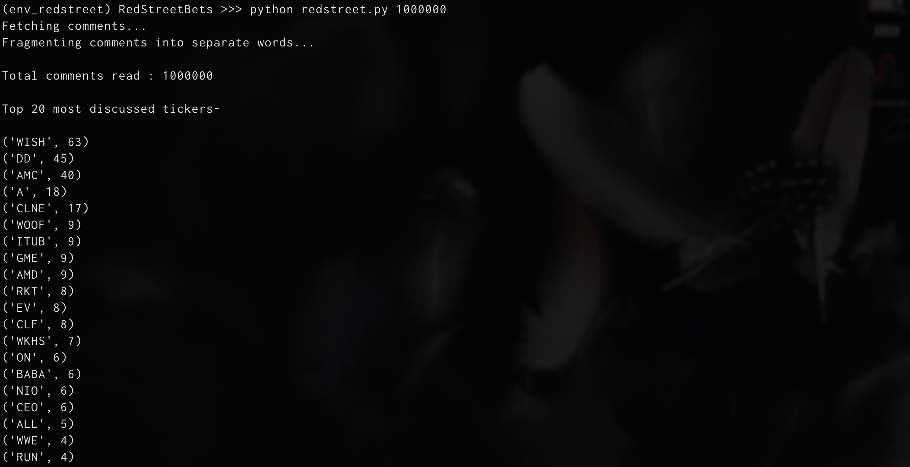

# RedStreetBets

A script that leverages the Reddit API to collect and analyse data from the Daily Discussions thread on Reddit subdomain /r/wallstreetbets to study stock market sentiment.

<br/>



### Why should you consider referring to this data ?

In recent times, the WallStreetBets have garnered a lot of attention to themselves. They have a constant and strong presence in the mind of various investors and financial professionals.

**Why might you ask?**

Because people believe that they have the ability to move markets.

The WallStreetBets have over 10,545,724 subscribers and they generate around 30,582 comments & 1,243 posts per day. They are also the 5th most visited website across the entire internet.

With over 4,346,692 comments in total, they are a goldmine for finance-related information.

If you want to make it big in the world of finance, that’s where you need to start.

## What the _redstreet_ script does?

The _redstreet_ script makes use of the Reddit API to lookup the specified number of comments and search for any stock tickers mentioned in the comments.

It returns a list of 20 top discussed stock tickers along with the number of times they were mentioned.

#### **How to run the script?**

-   Create a Reddit API key pair by going to https://www.reddit.com/prefs/apps

-   Create a file name `keys.py` in the project directory

-   Type out these credentials in the `keys.py` file (CLIENT_ID, SECRET_TOKEN, USERNAME, PASSWORD).

Eg.

```
CLIENT_ID="qgejsaYxoEw"
SECRET_TOKEN="aggdjnquwu2r83278itga0-tfe"
USERNAME="<your_username>"
PASSWORD="<your_password>"
```

> Note: CLIENT_ID and SECRET_TOKEN can be found after you create an app on this page: https://www.reddit.com/prefs/apps

Now, create a python virtual environment and install all project dependencies by running:

`pip install -r requirements.txt`

To run the script:

`python redstreet.py <no_of_comments_to_lookup>`
